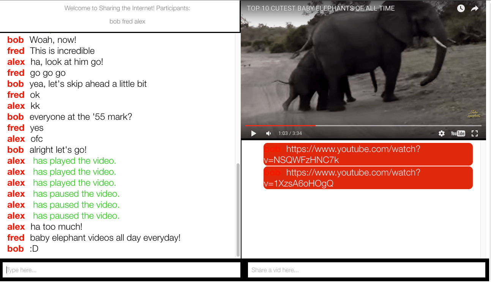

# Share the Internet

A chat application with synced video playback. Chat with your buddies and watch YouTube videos together. Built on [NodeJS](https://nodejs.org/en/), the [socket.io](http://socket.io/) api syncs up the videos so that everyone in the chatroom is watching the video at the same exact moment. This is sort of like the socket.io chat demo run wild. I got very excited with it and have been trying to see how far I can push it. 

## To-Do 
* ~~Get YouTube api up and running. Get it communicating with socket.io and server.~~
* ~~Create queue list for users to submit YouTube links~~
* ~~Hook up the queue list with the YouTube API~~
* Allow users to edit and remove links from the queue list
* Sync up all this queue data to other users in the chatroom
* Deploy to Heroku

## Features to implement later down the road
* Add ability to create separate chatrooms (cap users at a low number to create an intimate experience)
* Add the ability to submit ANYTHING! Not just YouTube videos, but gifs, links to other sites, pics, etc. Time to really share the internet!
